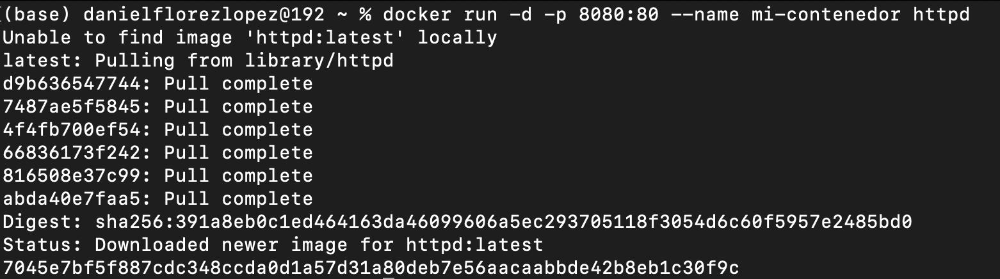
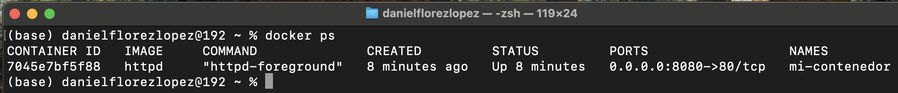
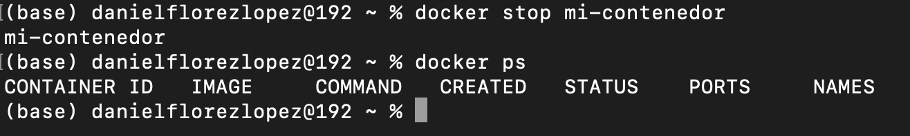
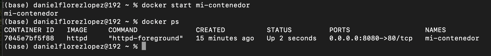
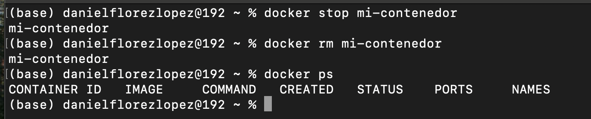
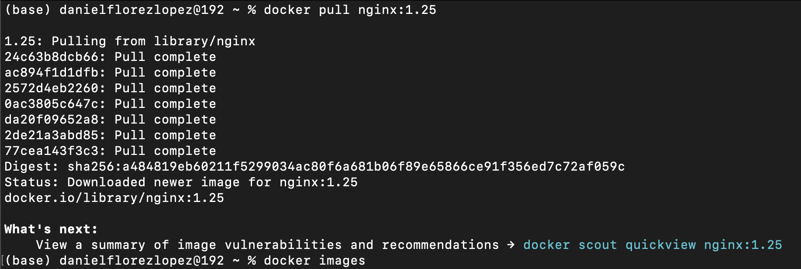
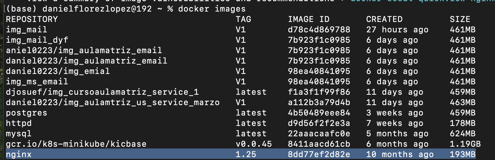
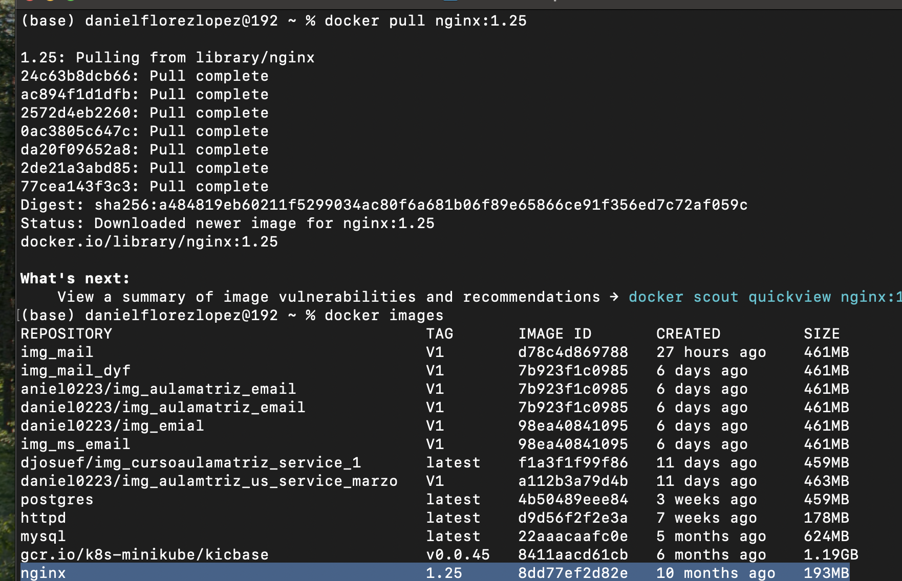

# Práctica 1. Crear un contenedor PostgreSQL con Docker

## Objetivo de la práctica:

Al finalizar la práctica, serás capaz de:
- Familiarizarte con las operaciones básicas de Docker, incluyendo la creación, gestión y manipulación de contenedores e imágenes.
- Aprender a ejecutar, detener, listar y reiniciar contenedores utilizando la interfaz de línea de comandos (CLI) de Docker, a fin de obtener las habilidades fundamentales para la gestión de contenedores y el despliegue de aplicaciones.

## Duración aproximada:
- 35 minutos.

---

**[Lista General](https://netec-mx.github.io/DOCK_KUB/)** | **[Siguiente ➡️](https://netec-mx.github.io/DOCK_KUB/Capitulo2/)**

---

## Instrucciones:

En esta práctica enfrentarás el reto de manejar contenedores utilizando Docker, una herramienta esencial en el desarrollo y despliegue de aplicaciones modernas. A continuación, sigue los siguientes pasos.

### Tarea 1. Crear y ejecutar un contenedor Docker.

Paso 1. Ingresa a la consola para ejecuar comandos de CLI de Docker.

Paso 2. Crea y ejecutar un contenedor llamado `mi-contenedor` utilizando la imagen httpd. 

```bash 
docker run -d -p 8080:80 --name mi-contenedor httpd
```



### Tarea 2. Uso de comandos. 

Para un manejo de docker es importante conocer los comandos básicos de Docker; a continuación, se presentan algunos comandos básicos, tales como listar, detener, reiniciar y eliminar contenedores.

Paso 1. Lista los contenedores en ejecución.

```bash
docker ps
```



Paso 2. Detén el contenedor `mi-contenedor`.

```bash 
docker stop mi-contenedor
```



Paso 3. Reinicia un contenedor.

```bash
docker restart mi-contenedor
```



Paso 4. Elimina un contenedor.

```bash 
docker rm mi-contenedor
```



### Tarea 3. Descargar una imagen de Docker Hub; por ejemplo, Nginx.

Paso 1. Descarga la imagen de Nginx desde Docker Hub.

```bash 
docker pull nginx:1.25
```



Paso 2. Observa la imagen descargada.

```bash
docker images
```



### Resultado esperado:


