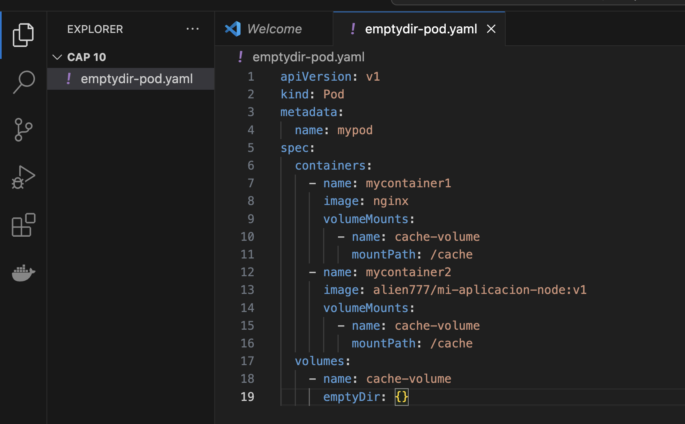
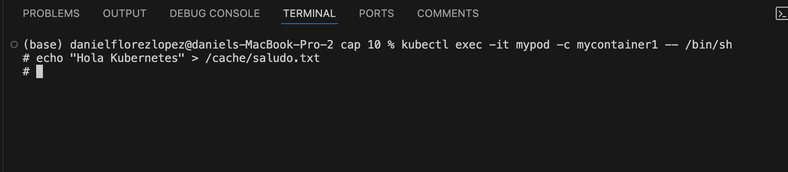
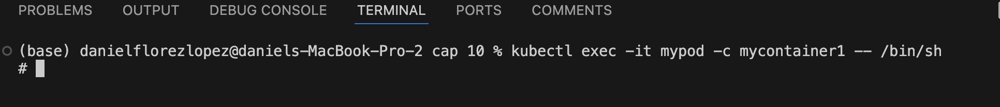
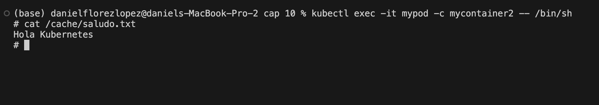

# Práctica 10. Trabajo con volúmenes emptyDir en Kubernetes

## Objetivo de la práctica:
Al finalizar la práctica, serás capaz de:
- Comprender el funcionamiento de los volúmenes emptyDir en Kubernetes, que son útiles para compartir datos entre contenedores en el mismo Pod.

## Duración aproximada:
- 60 minutos.

---

**[⬅️ Atrás](https://netec-mx.github.io/DOCK_KUB/Capitulo9/)** | **[Lista General](https://netec-mx.github.io/DOCK_KUB/)** | **[Siguiente ➡️](https://netec-mx.github.io/DOCK_KUB/Capitulo11/)**

---

## Instrucciones:

### Tarea 1. Creación de pod con volumen emptyDir.

Paso 1. Crea el `emptydir-pod.yaml` con la siguiente información:

```yaml
apiVersion: v1
kind: Pod
metadata:
  name: mypod
spec:
  containers:
    - name: mycontainer1
      image: nginx
      volumeMounts:
        - name: cache-volume
          mountPath: /cache
    - name: mycontainer2
      image: alien777/mi-aplicacion-node:v1
      volumeMounts:
        - name: cache-volume
          mountPath: /cache
  volumes:
    - name: cache-volume
      emptyDir: {}
```



Paso 2. Crea el pod con el siguiente comando:

```bash
kubectl apply -f emptydir-pod.yaml
```



Paso 3. Accede al contenedor para poder interactuar con el volumen.

```bash
kubectl exec -it mypod -c mycontainer1 -- /bin/sh
```



Paso 4. Una vez dentro del contenedor, crea un archivo en el directorio `/cache`; por ejemplo:

```bash
echo "Hola Kubernetes" > /cache/saludo.txt
exit
```

Paso 5. Accede al segundo contenedor y revisa el archivo que se guardó en el primer pod.

```bash
kubectl exec -it mypod -c mycontainer2 -- /bin/sh
cat /cache/saludo.txt
```



Paso 6. Elimina el pod.

```bash
kubectl delete pod mypod
```


### Resultado esperado:


