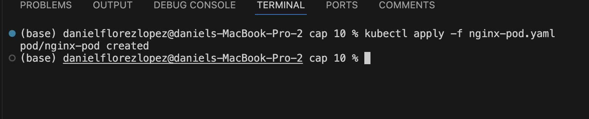
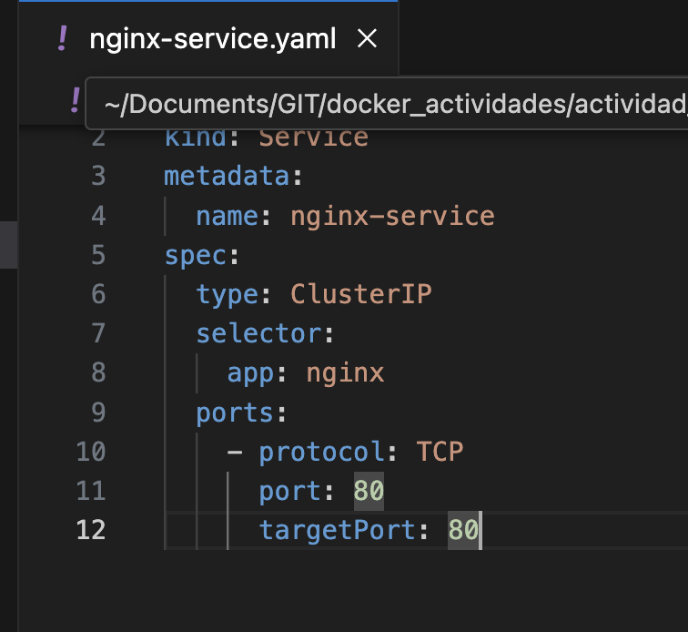
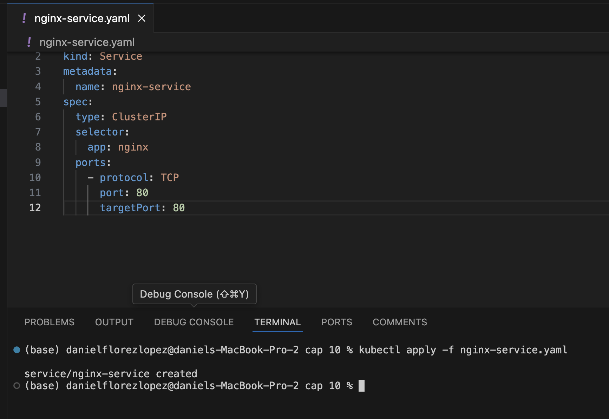
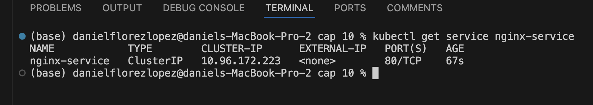

# Práctica 11. Creación de un servicio ClusterIP en Kubernetes

## Objetivo de la práctica:
Al finalizar la práctica, serás capaz de:
- Comprender y aplicar la creación de Pods en Kubernetes utilizando archivos de configuración YAML.
- Implementar un servicio ClusterIP para exponer un Pod dentro del clúster.
- Verificar el despliegue y la conectividad del servicio mediante comandos de Kubernetes

## Duración aproximada:
- 45 minutos.

---

**[⬅️ Atrás]()** | **[Lista General]()** | **[Siguiente ➡️]()**

---

## Instrucciones: 

### Tarea 1. Crear un Servicio ClusterIP.

Paso 1. Primero, crea un Pod que será expuesto por el servicio. Aquí tienes un ejemplo simple  utilizando nginx:

```yaml
apiVersion: v1
kind: Pod
metadata:
  name: nginx-pod
  labels:
    app: nginx
spec:
  containers:
    - name: nginx
      image: nginx
```

Paso 2. Crea el Pod con el siguiente comando:

```bash
kubectl apply -f pod.yaml
```



Paso 3. Crea un servicio ClusterIP para exponer el Pod:

```yaml
apiVersion: v1
kind: Service
metadata:
  name: nginx-service
spec:
  type: ClusterIP
  selector:
    app: nginx
  ports:
    - protocol: TCP
      port: 80
      targetPort: 80
```




Paso 4 . Crea el servicio con el siguiente comando:

```bash
kubectl apply -f nginx-service.yaml .
```



Paso 5. Verifica que el servicio se haya creado correctamente:

```bash
kubectl get service nginx-service
```



### Resultado esperado:


