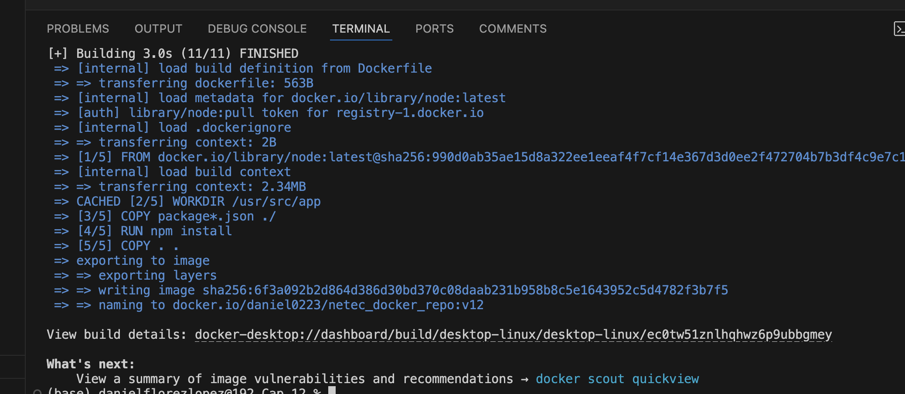
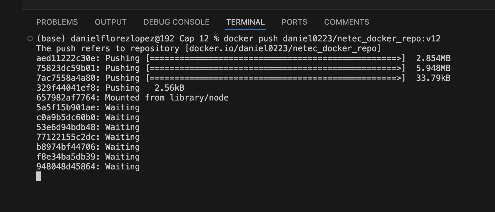
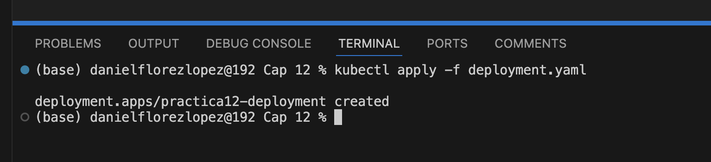
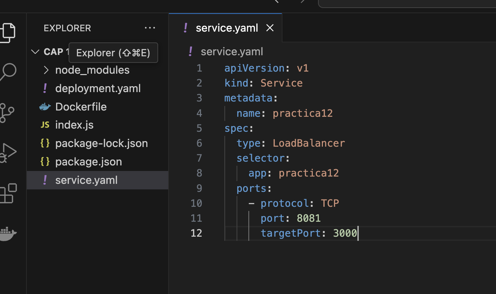
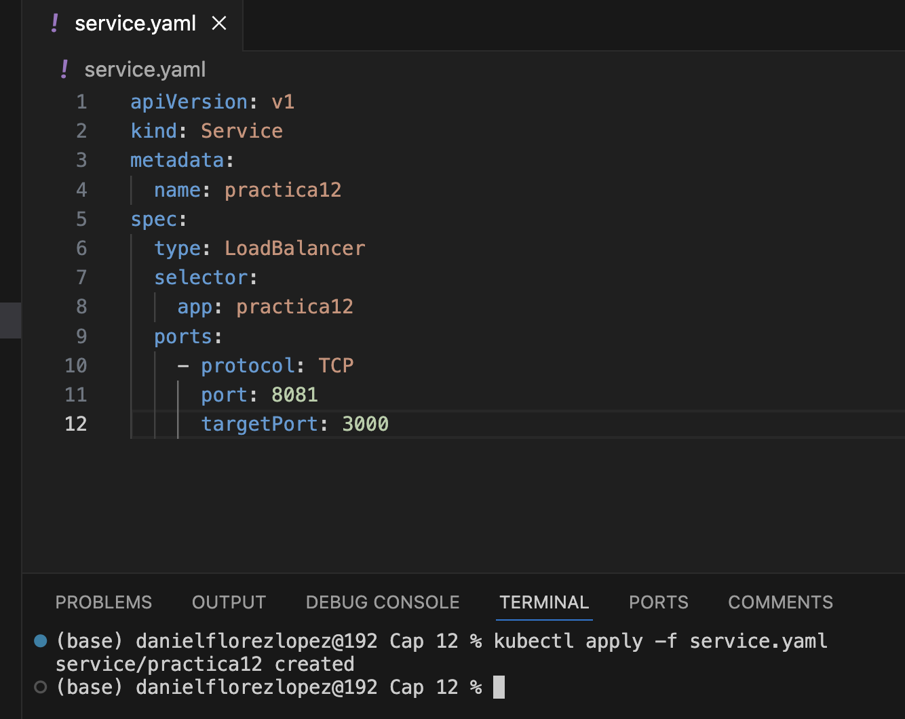
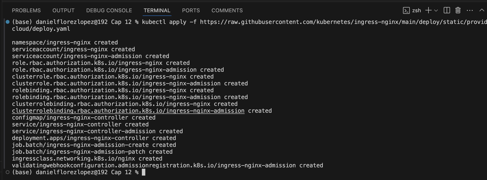
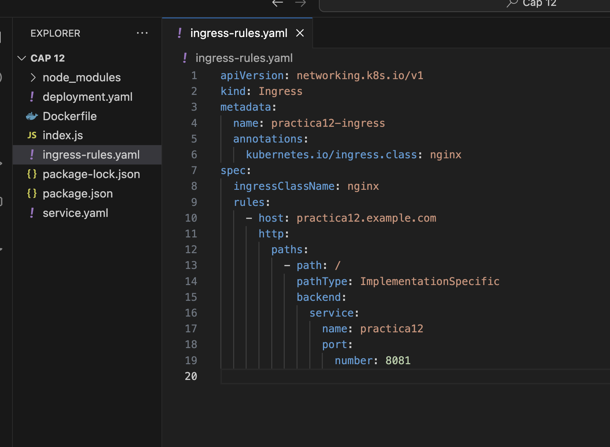
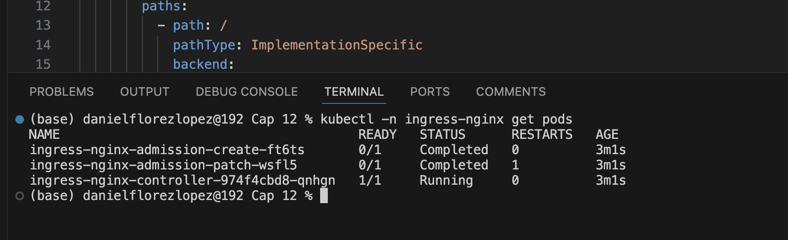

# Práctica 12. Despliegue de aplicación Node.js con Ingress en Kubernetes

## Objetivo de la práctica:
Al finalizar la práctica, serás capaz de:
- Crear una aplicación Node.js con Express y ejecutarla localmente.
- Construir y subir una imagen Docker de la aplicación a Docker Hub.
- Desplegar la aplicación en Kubernetes utilizando Deployment, Service e Ingress.

## Duración aproximada:
- 60  minutos.

---

**[⬅️ Atrás](https://netec-mx.github.io/DOCK_KUB/Capitulo11/)** | **[Lista General](https://netec-mx.github.io/DOCK_KUB/)**

---

## Instrucciones:

### Tarea 1. Crear una Aplicación Node.js.

Paso 1. Crea una carpeta llamada `lab12`; dentro de ésta crea un proyecto de express.

```bash
npm init -y
npm install express
```

Paso 2. Crea un archivo index.js y agrega el siguiente código:

```javascript
const express = require('express');
const app = express();
const port = 3000;

app.get('/', (req, res) => {
  res.send('Practica 12!');
});

app.listen(port, () => {
  console.log(`Aplicación escuchando en el puerto ${port}`);
});
```

Paso 3. Crea un archivo Dockerfile y agregar el siguiente código:

```Dockerfile
# Usa la última versión de Node.js como base
FROM node:latest  

# Establece el directorio de trabajo dentro del contenedor
WORKDIR /usr/src/app  

# Copia solo los archivos de dependencias para aprovechar la caché de Docker
COPY package*.json ./  

# Instala las dependencias
RUN npm install  

# Copia el resto de los archivos del proyecto
COPY . .  

# Expone el puerto 3000 para acceder al contenedor
EXPOSE 3000  

# Comando de inicio de la aplicación
CMD ["node", "server.js"]

```

Paso 4. Crea una imagen de Docker con el siguiente comando:

```bash
docker build -t daniel0223/netec_docker_repo:v12 .
```



Paso 5. Sube la imagen a Docker Hub.

```bash
docker push daniel0223/netec_docker_repo:v12 
```




### Tarea 2. Crear los objetos Deployment y Service.

Paso 1. Crea un archivo deployment.yaml y agrega el siguiente código:

```yaml
apiVersion: apps/v1
kind: Deployment
metadata:
  name: practica12-deployment
spec:
  replicas: 3
  selector:
    matchLabels:
      app: practica12
  template:
    metadata:
      labels:
        app: practica12
    spec:
      containers:
        - name: practica12
          image: daniel0223/netec_docker_repo:v12
          ports:
            - containerPort: 3000
```



Paso 2. Crea el deploy.

```bash
kubectl apply -f deployment.yaml
```



Paso 3. Crea el archivo `service.yaml`.

```yaml
apiVersion: v1
kind: Service
metadata:
  name: practica12
spec:
  type: LoadBalancer
  selector:
    app: practica12
  ports:
    - protocol: TCP
      port: 8081
      targetPort: 3000
```


Paso 4. Crea el servicio:

```bash
kubectl apply -f service.yaml
```




Paso 5. crear el ingress con Nginx

```yaml
kubectl apply -f https://raw.githubusercontent.com/kubernetes/ingress-nginx/main/deploy/static/provider/cloud/deploy.yaml
```



Paso 6. Crea el archivo `ingress-rules.yaml`.

```yaml
apiVersion: networking.k8s.io/v1
kind: Ingress
metadata:
  name: practica12-ingress
  annotations:
    kubernetes.io/ingress.class: nginx
spec:
  ingressClassName: nginx
  rules:
    - host: practica12.example.com
      http:
        paths:
          - path: /
            pathType: ImplementationSpecific
            backend:
              service:
                name: practica12
                port:
                  number: 8081
```



### Resultado esperado:


