# Práctica 2. Gestión avanzada de contenedores Docker con Node.js

## Objetivo de la práctica:
Al finalizar la práctica, serás capaz de:
- Profundizar en aspectos avanzados del manejo de Docker, enfocándose en el manejo de logs, la interacción avanzada con contenedores, la limitación de recursos, el monitoreo y la manipulación de imágenes Docker.
- Desarrollar habilidades críticas para el mantenimiento eficiente y la gestión de aplicaciones en contenedores, aprendiendo a diagnosticar y resolver problemas comunes, optimizar el rendimiento y asegurar la eficiencia de los recursos.

## Duración aproximada:
- 45 minutos.

---

**[⬅️ Atrás](https://netec-mx.github.io/DOCK_KUB/Capitulo1/)** | **[Lista General](https://netec-mx.github.io/DOCK_KUB/)** | **[Siguiente ➡️](https://netec-mx.github.io/DOCK_KUB/Capitulo3/)**

---

## Instrucciones:
En esta práctica te enfrentarás al desafío de aplicar técnicas avanzadas en la gestión de contenedores Docker.

### Tarea 1. Configuración de una Aplicación NodeJS.

Paso 1. Crea una carpeta llamada `seconLab`.

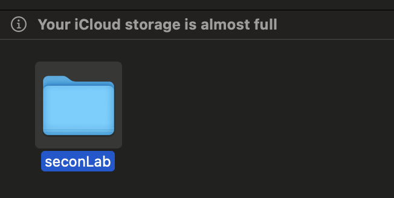

Paso 2. Crea un proyecto backend en **Node.js** con un endpoint y, posteriormente, dockerízalo. Para ello, ubícate en la carpeta `secondLab` y ejecuta el siguiente comando:

```bash
npm init -y|
```

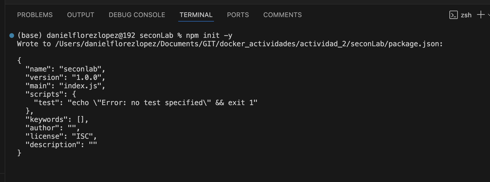

Paso 3. Una vez ejecutado el comando, se generará el archivo **package.json**.

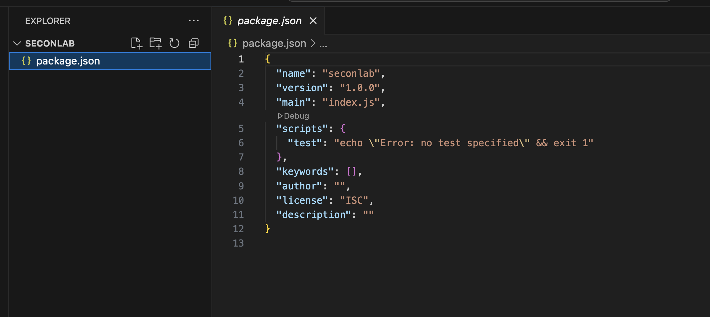

Paso 4. Crea un archivo llamado `app.js` con el siguiente contenido:

```javascript
const express = require('express');
const app = express();
const port = 3000;
app.get('/', (req, res) => {
    res.send('Hola Docker!');
});
app.listen(port, () => {
    console.log(`Aplicación escuchando en http://localhost:${port}`);
});
```
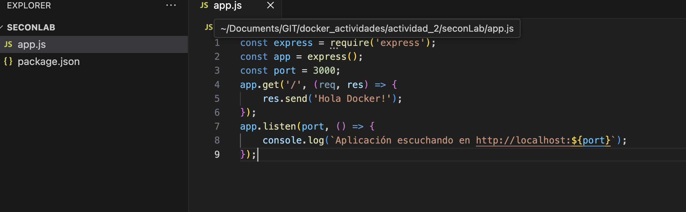

Paso 5. Instala **Express** ejecutando el siguiente comando:

```bash
npm install express --save
```

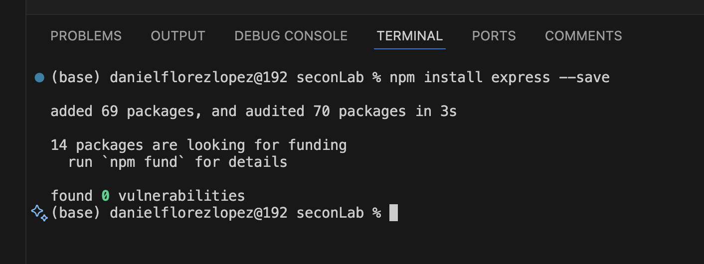

Paso 6. Ejecuta la aplicación con el siguiente comando:

```bash
node app.js
```

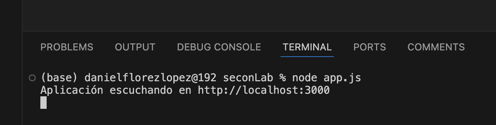

Paso 7. Abre tu navegador y verifica que la aplicación esté funcionando correctamente.

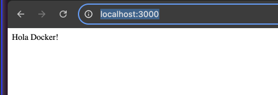

### Tarea 2. Dockerfile para la Aplicación NodeJS.

Paso 1. Crea un archivo llamado `Dockerfile` en la carpeta `seconLab` con el siguiente contenido:

```dockerfile
FROM node:latest
WORKDIR /usr/src/app
COPY package*.json ./
RUN npm install
COPY . .
EXPOSE 3000
CMD ["node", "app.js"]
```

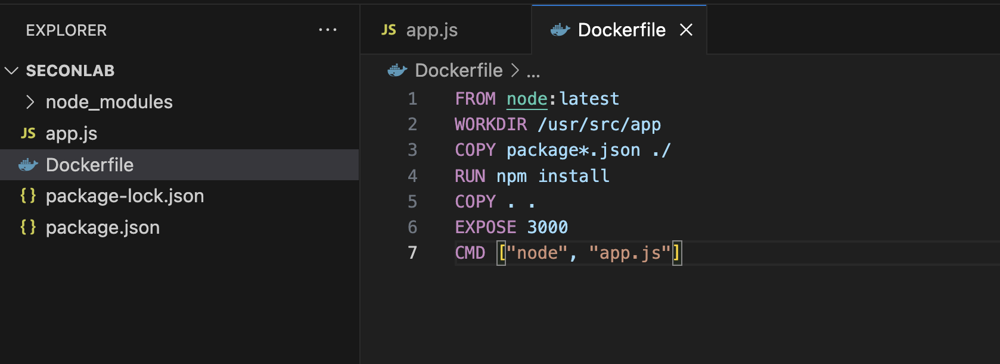

Paso 2. Construye la imagen Docker con el siguiente comando:

```bash
docker build -t lab2 .
```

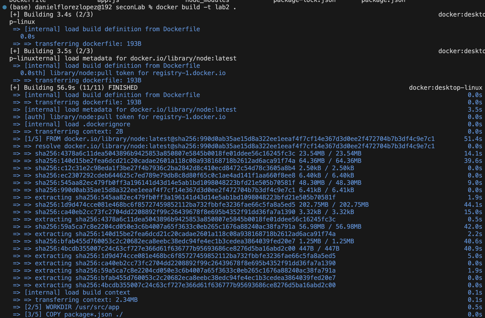

Paso 3. Ejecuta el contenedor con el siguiente comando:

```bash
docker run -d -p 3000:3000 lab2
```

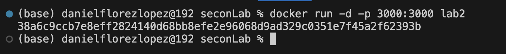

Paso 4. Verifica que la aplicación esté funcionando correctamente en el navegador.


### Tarea 3. Logs de un Contenedor.

Paso 1. Consulta los logs del contenedor con el siguiente comando:

```bash
docker logs <container_id>
```

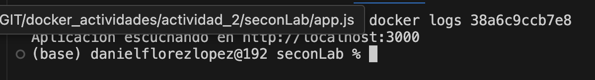

Paso 2. Verifica los logs del contenedor en tiempo real con el siguiente comando:

```bash
docker logs -f <container_id>
```

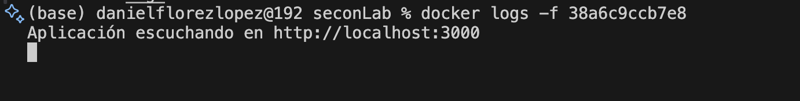


### Resultado esperado:

Al finalizar, habrás adquirido habilidades avanzadas en el manejo de contenedores Docker, aplicando técnicas avanzadas en la gestión de logs, la interacción avanzada con contenedores, la limitación de recursos, el monitoreo y la manipulación de imágenes Docker.


