# Práctica 3. Almacenamiento en Docker: Volúmenes y montajes con Node.js

## Objetivo de la práctica:
Al finalizar la práctica, serás capaz de:
- Manejar diferentes opciones de almacenamiento en Docker, incluyendo volúmenes, montajes de enlace y tmpfs.
- Crear y administrar volúmenes de Docker.
- Comprender el uso de **bind mounts** para montar directorios específicos.

## Duración aproximada:
- 45 minutos.

---

**[⬅️ Atrás](https://netec-mx.github.io/DOCK_KUB/Capitulo2/)** | **[Lista General](https://netec-mx.github.io/DOCK_KUB/)** | **[Siguiente ➡️](https://netec-mx.github.io/DOCK_KUB/Capitulo4/)**

---

## Instrucciones:

### Tarea 1. Búsqueda de imágenes con Docker Search.

Paso 1. Para buscar imágenes en Docker Hub, ejecuta el siguiente comando:

```bash
docker search node
```

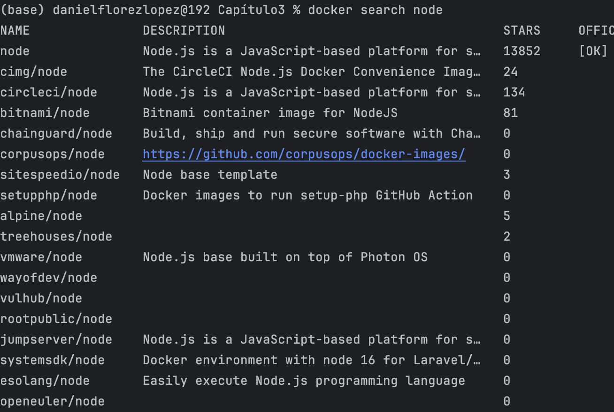

Paso 2. Descarga una imagen en Docker Hub:

```bash
docker pull node
```

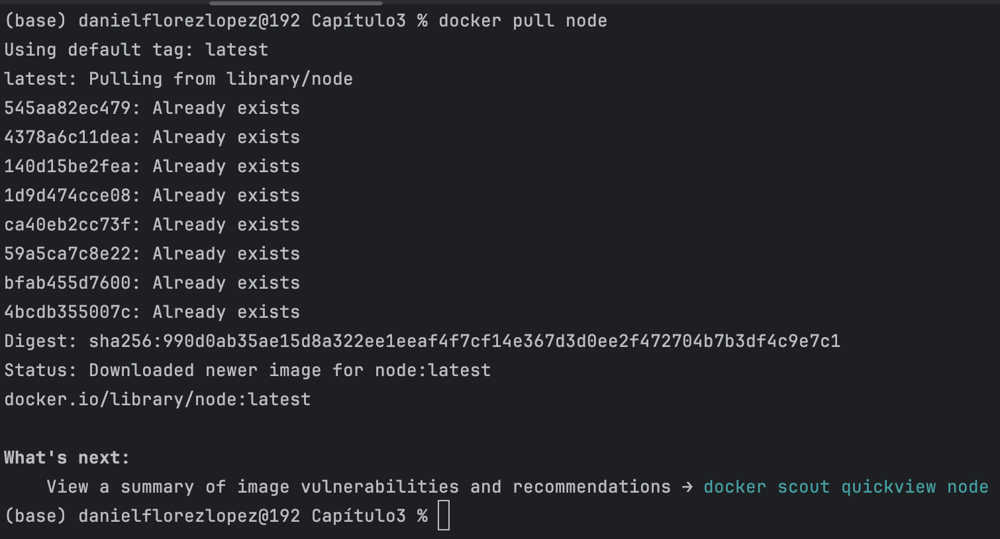

Paso 3. Inspecciona los detalles de la imagen.

```bash
docker inspect node
```

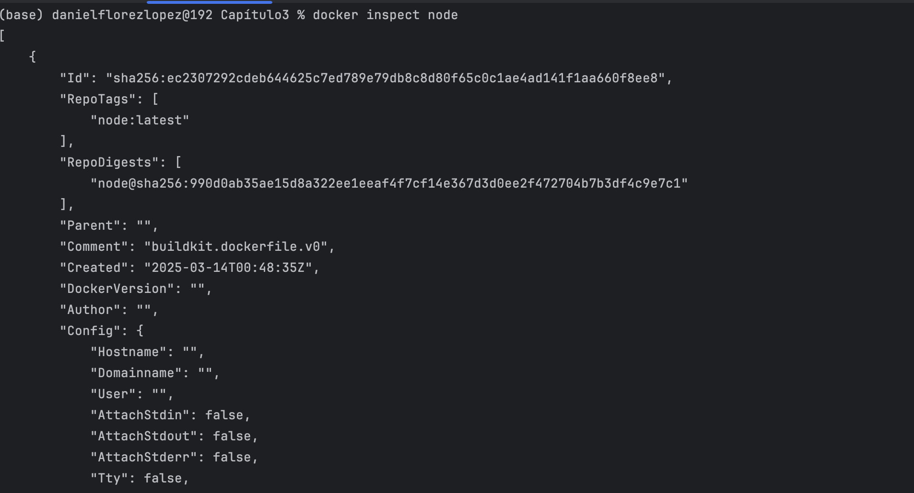

Paso 4. Consulta el historial de la imagen.

```bash
docker history node
```

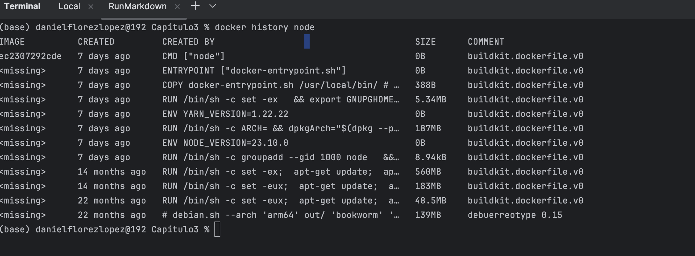

Paso 5. Elimina la imagen.

```bash
docker rmi node
```

Elimina una imagen específica del sistema local, reemplazando [IMAGE_ID] con el ID correspondiente de la imagen por eliminar.

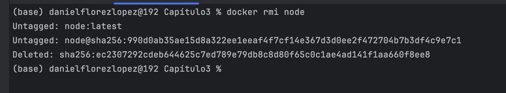


### Tarea 2. Creación y optimización de Dockerfiles con una Aplicación NodeJS.

Vamos a crear una aplicación web simple que responda con un mensaje de bienvenida.

Paso 1. Crea el directorio del proyecto llamado `thirdlab`.

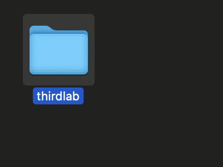

Paso 2. Inicializa un nuevo proyecto Node.JS. Inicializa el proyecto con NPM para crear un **package.json**.

```bash
npm init -y
```


Paso 3. Crea el archivo de la aplicación NodeJS. Crea un archivo llamado `index.js` con el siguiente contenido:

```javascript
const express = require('express');
const app = express();
const port = 3000;
app.get('/', (req, res) => {
res.send('¡Bienvenido a mi aplicación NodeJS en Docker!');
});
app.listen(port, () => {
console.log(`Aplicación escuchando en http://localhost:${port}`);
});
```

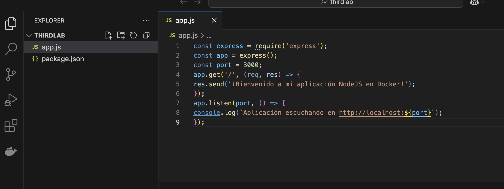

Paso 4. Añade **Express**, el framework de servidor web para NodeJS:

```bash
npm install express --save
```

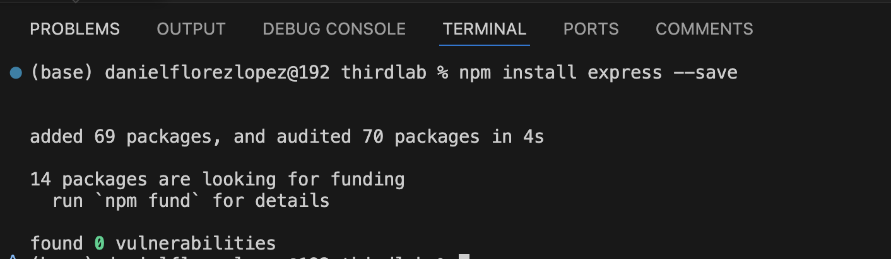

Paso 5. Crea un archivo **Dockerfile** en el directorio del proyecto con el siguiente contenido:

```Dockerfile
FROM node:14  
# Usa Node.js 14 como base.  

RUN useradd -m nonrootuser  
USER nonrootuser  
# Crea y usa un usuario sin privilegios para mayor seguridad.  

WORKDIR /usr/src/app  
# Define el directorio de trabajo en el contenedor.  

COPY package*.json ./  
RUN npm install  
# Copia solo los archivos de dependencias primero y las instala (mejora la caché de Docker).  

COPY . .  
# Copia el resto del código al contenedor.  

EXPOSE 3000  
# Expone el puerto 3000 (solo informativo, no abre la conexión).  

CMD ["node", "app.js"]  
# Ejecuta la aplicación al iniciar el contenedor.  
```

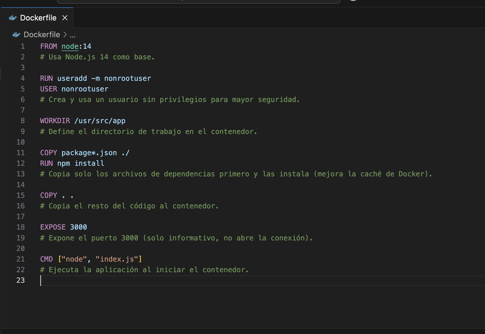

Paso 6. Construye la imagen de Docker con el siguiente comando:

```bash
docker build -t nodeapp .
```

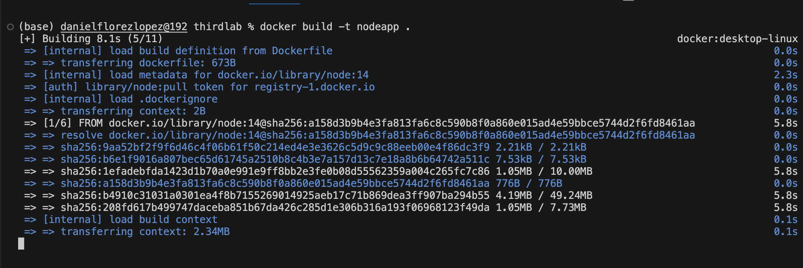

Paso 7. Ejecuta la imagen de Docker con el siguiente comando:

```bash
docker run -p 3000:3000 nodeapp
```

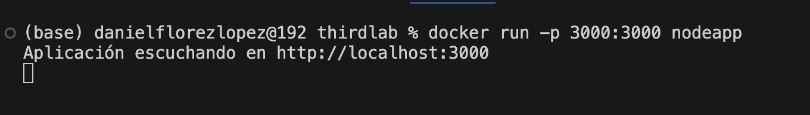

## Resultado esperado:

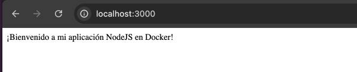
