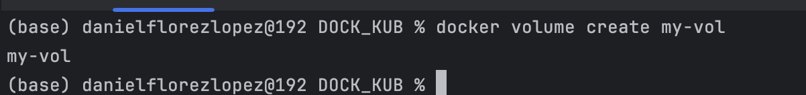
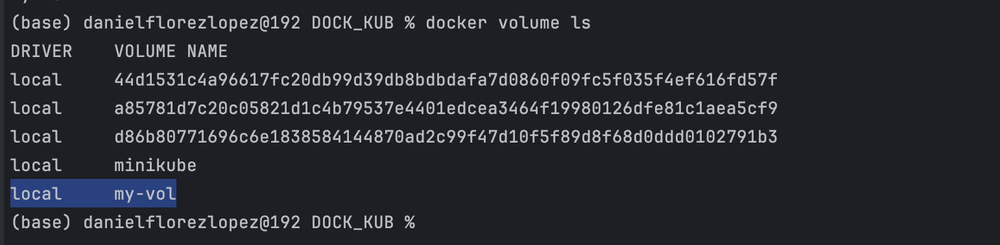
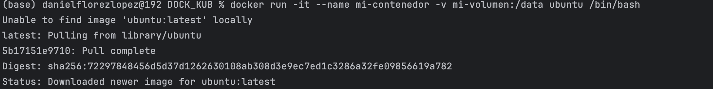
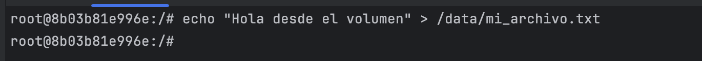
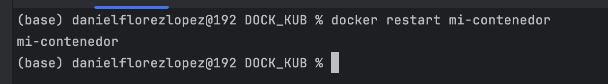
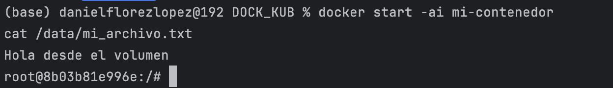

# Práctica 4. Persistencia de datos con volúmenes en Docker

## Objetivo de la práctica:
Al finalizar la práctica, serás capaz de:
- Crear y gestionar volúmenes para la persistencia de datos.
- Verificar la persistencia de archivos dentro de un volumen después de reiniciar un contenedor.
- Montar un directorio del host en un contenedor usando Bind Mounts.

## Duración aproximada:
- 45 minutos.

---

**[⬅️ Atrás](https://netec-mx.github.io/DOCK_KUB/Capitulo3/)** | **[Lista General](https://netec-mx.github.io/DOCK_KUB/)** | **[Siguiente ➡️](https://netec-mx.github.io/DOCK_KUB/Capitulo5/)**

---

## Instrucciones:

### Tarea 1. Trabajando con Volúmenes (Volumes).

Paso 1. Crea un Volumen. Para ello, abre CMD y ejecuta el siguiente comando:

```bash
docker volume create my-vol
```



Paso 2. Verifica la creación del volumen. Asimismo, abre CMD y ejecuta:

```bash
docker volume ls
```



Paso 3. Usa el volumen en un Contenedor.

```bash
docker run -it --name mi-contenedor -v mi-volumen:/data ubuntu /bin/bash
```



Paso 4. Interactúa con el volumen. Dentro del contenedor, crea un archivo en `/data`:

```bash
echo "Hola desde el volumen" > /data/mi_archivo.txt
```



Paso 5. Verifica la persistencia de datos. Sal del contenedor y reinícialo:

```bash
docker restart mi-contenedor
```



Paso 6. Verifica la Persistencia de Datos. Vuelve a entrar al contenedor y verifica que el archivo creado en el volumen sigue existiendo:

```bash
docker exec -it mi-contenedor /bin/bash
cat /data/mi_archivo.txt
```



### Resultado esperado:


