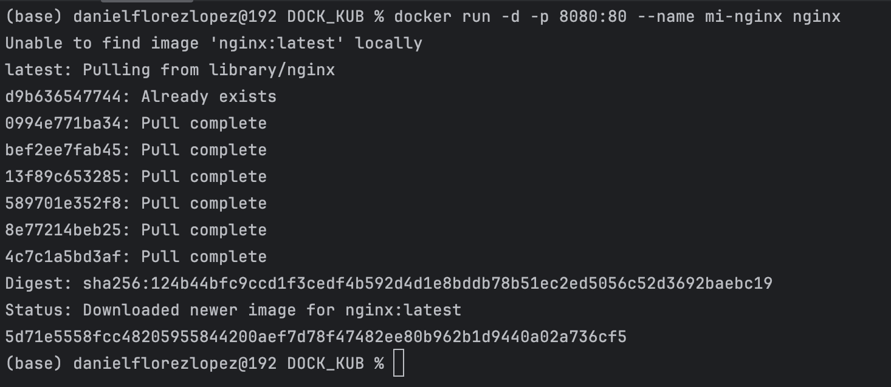
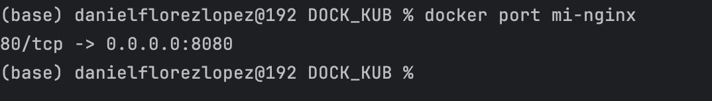
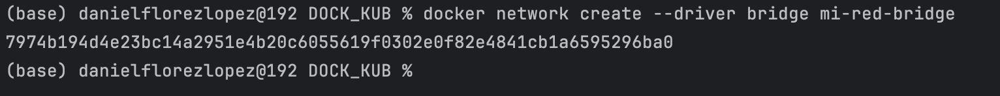
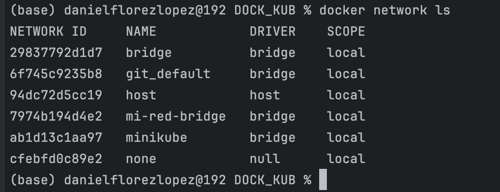
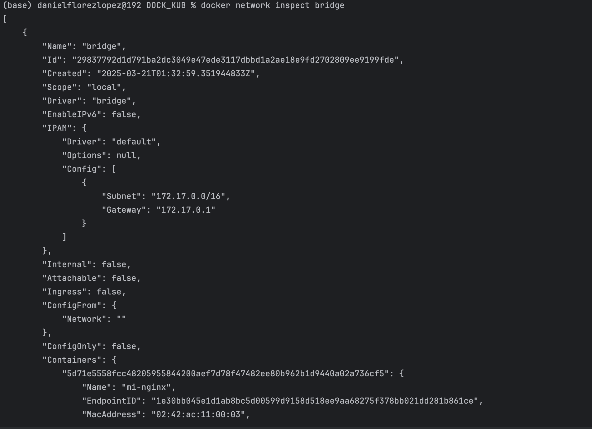
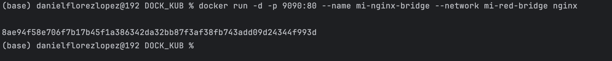
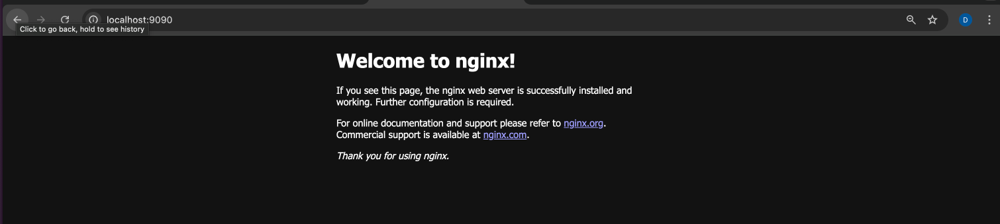

# Práctica 5. Conectividad y redes en Docker con NGINX

## Objetivo de la práctica:
Al finalizar la práctica, serás capaz de:
- Configurar y gestionar redes en Docker.
- Manejar la conectividad entre contenedores, incluyendo el mapeo de puertos y la configuración de redes.
- Asegurar la accesibilidad y correcto funcionamiento de aplicaciones en contenedores en distintos entornos de red.

## Duración aproximada:
- 40 minutos.

---

**[⬅️ Atrás](https://netec-mx.github.io/DOCK_KUB/Capitulo4/)** | **[Lista General](https://netec-mx.github.io/DOCK_KUB/)** | **[Siguiente ➡️](https://netec-mx.github.io/DOCK_KUB/Capitulo6/)**

---

## Instrucciones:

Durante esta práctica, realizarás tareas clave en la gestión de redes en Docker, tales como:
- Preparar el entorno verificando que Docker está instalado y funcionando correctamente.
- Ejecutar un contenedor NGINX y mapear los puertos del contenedor a los del host, lo cual es esencial para la accesibilidad de servicios basados en contenedores.
- Explorar los puertos utilizados por los contenedores, habilidad fundamental para la resolución de conflictos de red y la configuración de firewalls y enrutamientos.

Esta práctica proporcionará a los participantes una comprensión práctica de cómo las redes funcionan en el contexto de Docker y los preparará para desafíos más avanzados relacionados con la conectividad de contenedores y la configuración de redes.

### Tarea 1. Creación de una red en Docker.

Paso 1. Ejecuta un contenedor de prueba y mapea los puertos.

Utiliza un servidor NGINX como ejemplo:

```bash
docker run -d -p 8080:80 --name mi-nginx nginx
```



Paso 2. Lista los Puertos del Contenedor.

Ejecuta el siguiente comando para ver los puertos mapeados:

```bash
docker port mi-nginx
```



Paso 3. Crear una Red de Tipo Bridge: Crea una red personalizada en Docker:

```bash
docker ps
```



Paso 4. Lista las Redes de Docker.

Utiliza el siguiente comando para visualizar las redes de Docker.

```bash
docker network ls
```



Paso 5. Inspecciona una Red.

Utiliza el siguiente comando para inspeccionar una red.

```bash
docker network inspect bridge
```



Paso 6. Inicia un contenedor en la red personalizada.

Ejecuta un nuevo contenedor y únete a la red **mi-red-bridge**:

```bash
docker run -d -p 9090:80 --name mi-nginx-bridge --network mi-red-bridge nginx
```




## Resultado esperado:


