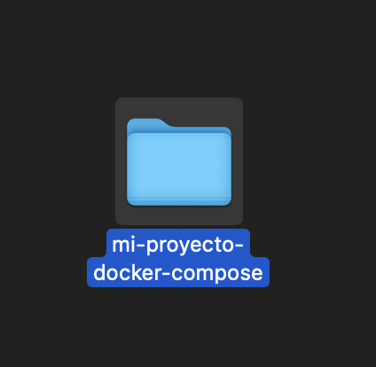
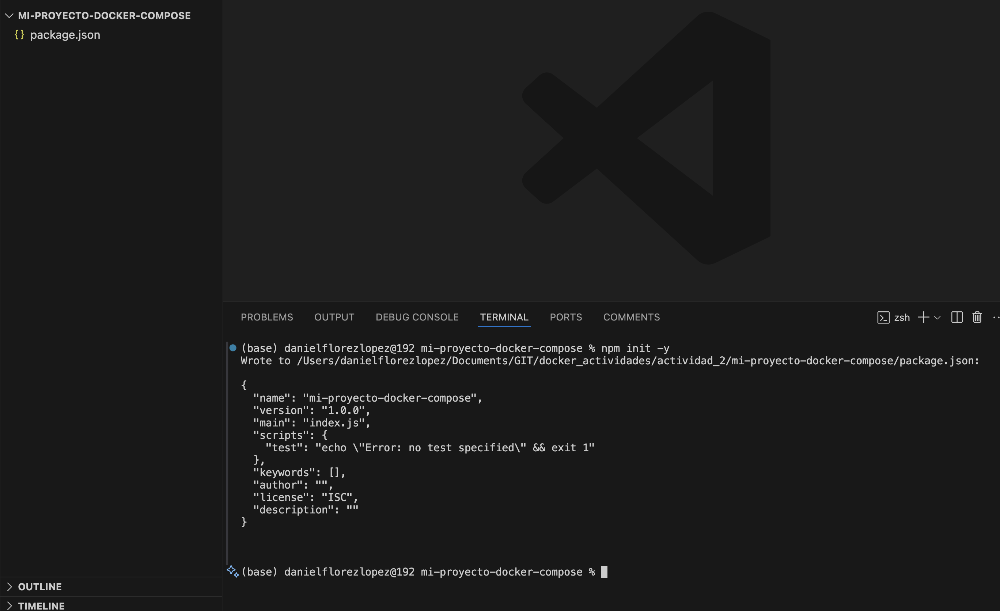
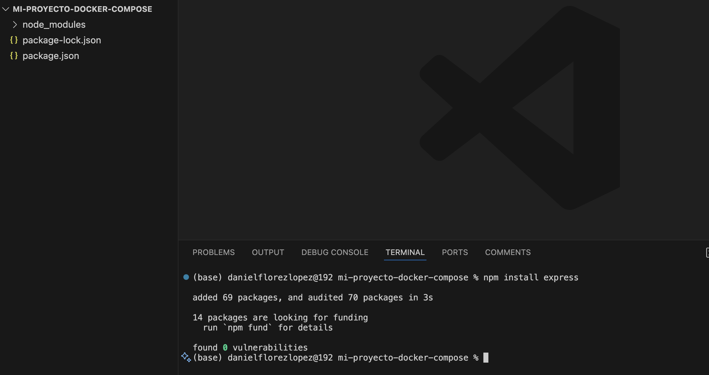
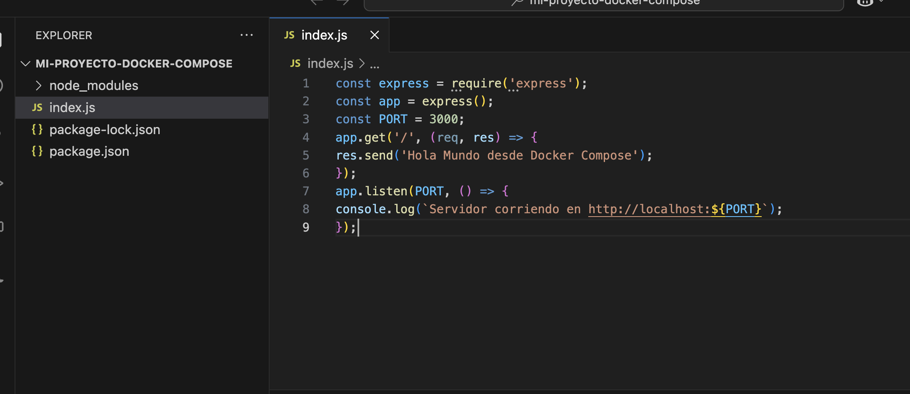
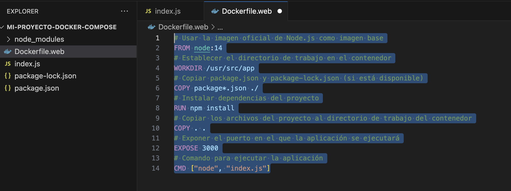
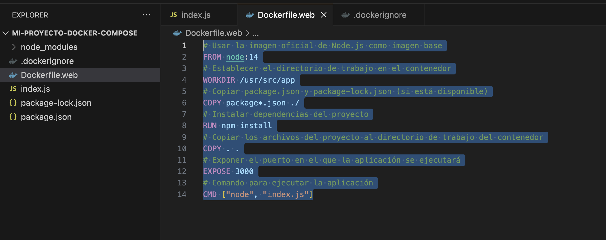
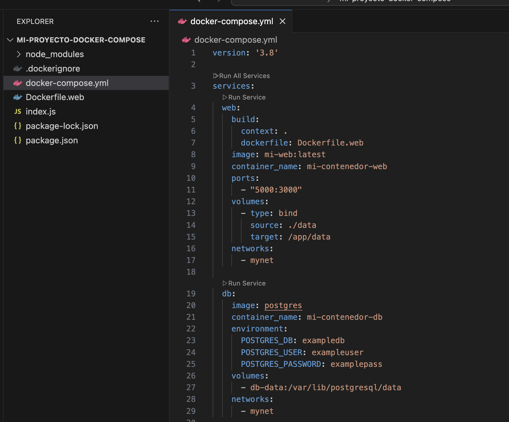
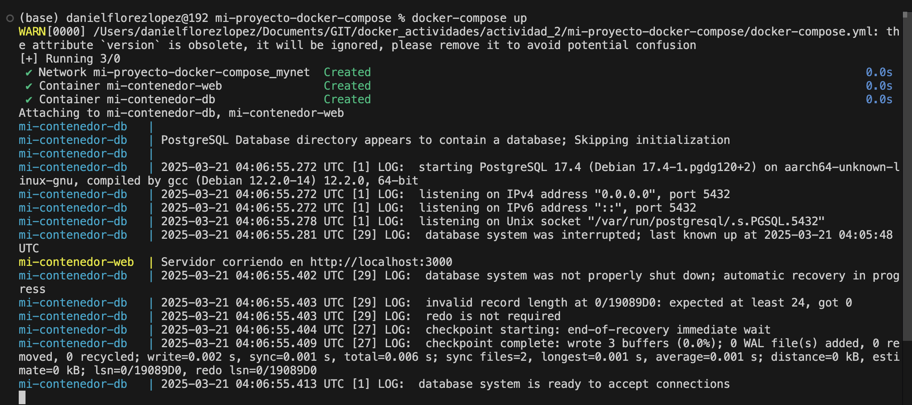
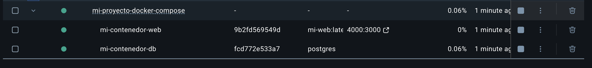

# Práctica 6. Orquestación de contenedores con Docker Compose

## Objetivo de la práctica:

Al finalizar la práctica, serás capaz de:
- Comprender los fundamentos de Docker Compose para la orquestación de contenedores en un entorno de desarrollo.
- Aprender a configurar y utilizar archivos docker-compose.yml para definir y gestionar aplicaciones multicontenedor.
- Ejecutar múltiples contenedores que interactúan entre sí, simulando un entorno real de desarrollo.

## Duración aproximada:
- 55 minutos.

---

**[⬅️ Atrás](https://netec-mx.github.io/DOCK_KUB/Capitulo5/)** | **[Lista General](https://netec-mx.github.io/DOCK_KUB/)** | **[Siguiente ➡️](https://netec-mx.github.io/DOCK_KUB/Capitulo7/)**

---

## Instrucciones:

### Tarea 1. Crear una Aplicación Web Simple (Node.js).

Paso 1. Crea un directorio de trabajo para la aplicación web con Node.js con el nombre `mi-proyecto-docker-compose`.



Paso 2. Inicializa un Proyecto Node.js. Para ello, crea un nuevo archivo package.json ejecutando el comando:

```bash
npm init -y
```



Paso 3. Instala el módulo express en el proyecto, ejecutando el comando:

```bash
npm install express
```



Paso 4. Crea un archivo index.js en el directorio raíz del proyecto y agregar el siguiente código:

```javascript
const express = require('express');
const app = express();
const PORT = 3000;
app.get('/', (req, res) => {
res.send('Hola Mundo desde Docker Compose');
});
app.listen(PORT, () => {
console.log(`Servidor corriendo en http://localhost:${PORT}`);
});
```



Paso 5. Crea un archivo llamado `Dockerfile.web` en el directorio del proyecto y agrega el siguiente contenido:

```bash
# Usar la imagen oficial de Node.js como imagen base
FROM node:14
# Establecer el directorio de trabajo en el contenedor
WORKDIR /usr/src/app
# Copiar package.json y package-lock.json (si está disponible)
COPY package*.json ./
# Instalar dependencias del proyecto
RUN npm install
# Copiar los archivos del proyecto al directorio de trabajo del contenedor
COPY . .
# Exponer el puerto en el que la aplicación se ejecutará
EXPOSE 3000
# Comando para ejecutar la aplicación
CMD ["node", "index.js"]
```



Paso 6. Crea un archivo .dockerignore para evitar copiar archivos innecesarios al contenedor:

```bash
node_modules
npm-debug.log
```



### Tarea 2. Configuración de Docker Compose y ejecución del proyecto.

Paso 1. En el directorio del proyecto, crea un archivo docker-compose.yml con la siguiente configuración:

```bash
version: '3.8'

services:
  web:
    build:
      context: .
      dockerfile: Dockerfile.web
    image: mi-web:latest
    container_name: mi-contenedor-web
    ports:
      - "5000:3000"
    volumes:
      - type: bind
        source: ./data
        target: /app/data
    networks:
      - mynet

  db:
    image: postgres
    container_name: mi-contenedor-db
    environment:
      POSTGRES_DB: exampledb
      POSTGRES_USER: exampleuser
      POSTGRES_PASSWORD: examplepass
    volumes:
      - db-data:/var/lib/postgresql/data
    networks:
      - mynet

networks:
  mynet:

volumes:
  db-data:
```



Paso 2. Ejecuta el comando `docker-compose up` para construir y ejecutar los contenedores definidos en el archivo docker-compose.yml:

```bash
docker-compose up
```




### Resultado esperado:


