# Práctica 7. Contenerización y despliegue en Kubernetes de una aplicación Node.js

## Objetivo de la práctica:
Al finalizar la práctica, serás capaz de:
- Configurar el entorno de trabajo asegurándose de que Docker esté instalado y funcionando correctamente.
- Ejecutar un contenedor NGINX, mapeando los puertos entre el contenedor y el host para garantizar la accesibilidad del servicio.
- Identificar y analizar los puertos utilizados por los contenedores, facilitando la resolución de conflictos de red y la configuración de firewalls y enrutamientos.

## Duración aproximada:
- 90 minutos.

---

**[⬅️ Atrás]()** | **[Lista General]()** | **[Siguiente ➡️]()**

---

## Instrucciones:

### Tarea 1. Create aplicacion de node js.

Paso 1. Crea una carpeta que se llame `mi-aplicacion`, inicializa el proyecto e instala **express**.

```bash
npm init -y
npm install express
```

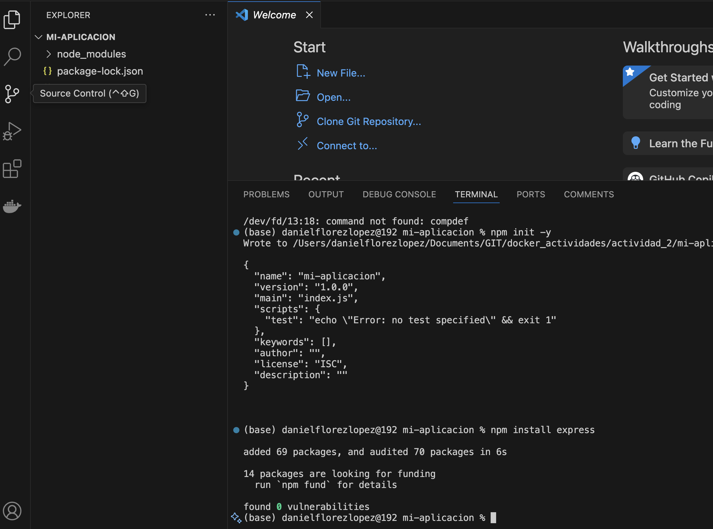

Paso 2. Crea un archivo llamado `index.js` y agrega el siguiente código:

```javascript
const express = require('express');
const app = express();
const port = 3000;
app.get('/', (req, res) => {
res.send('Hola Mundo desde Node.js!');
});
app.listen(port, () => {
console.log(`Aplicación escuchando en el puerto ${port}`);
});
```

Paso 3. Crea un Dockerfile para contenerizar el servicio.

```bash
FROM node:14
WORKDIR /usr/src/app
COPY package*.json ./
RUN npm install
COPY . .
EXPOSE 3000
CMD ["node", "index.js"]
```

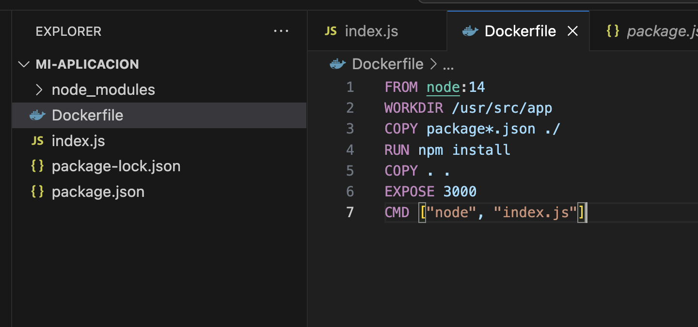

### Tarea 2. Subir imagen a Docker Hub.

Paso 1. Para crear una cuenta en Docker Hub, visita [Docker Hub](https://hub.docker.com/).

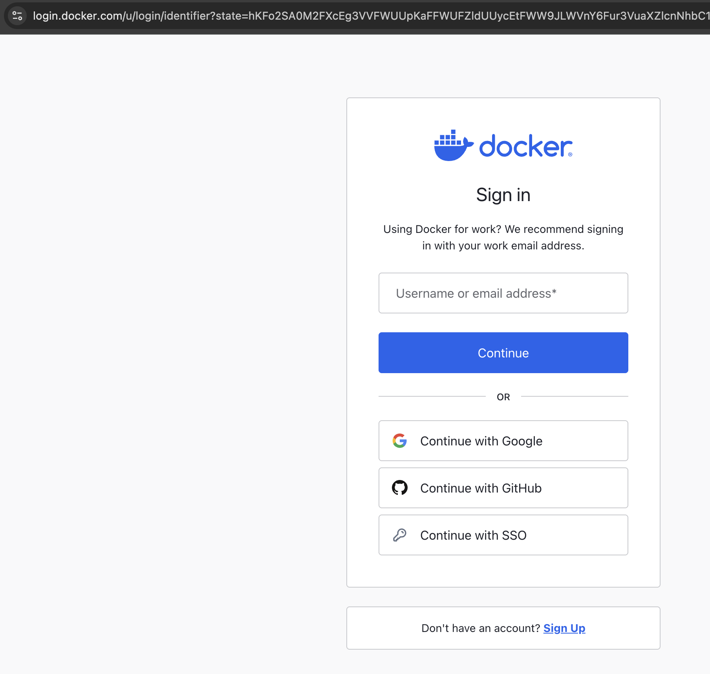

Paso 2. Crea un repositorio en Docker Hub.

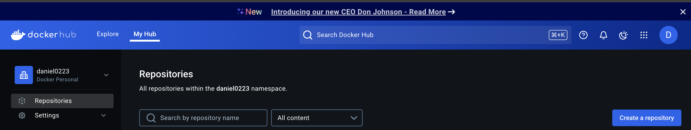

Paso 3. Agrega un nombre de usuario y uno del repositorio `<netec_docker_repo>`.

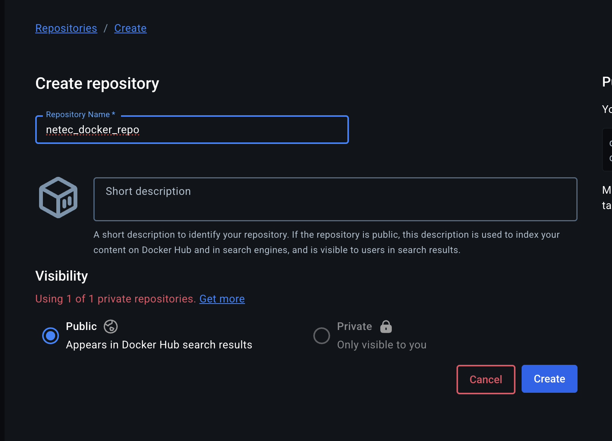

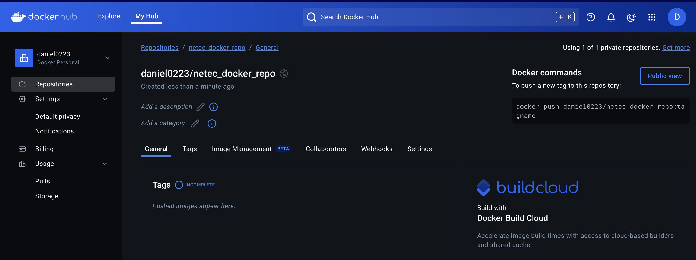

Paso 4. Crea una imagen de Docker.

```bash
docker build -t daniel0223/netec_docker_repo .
```

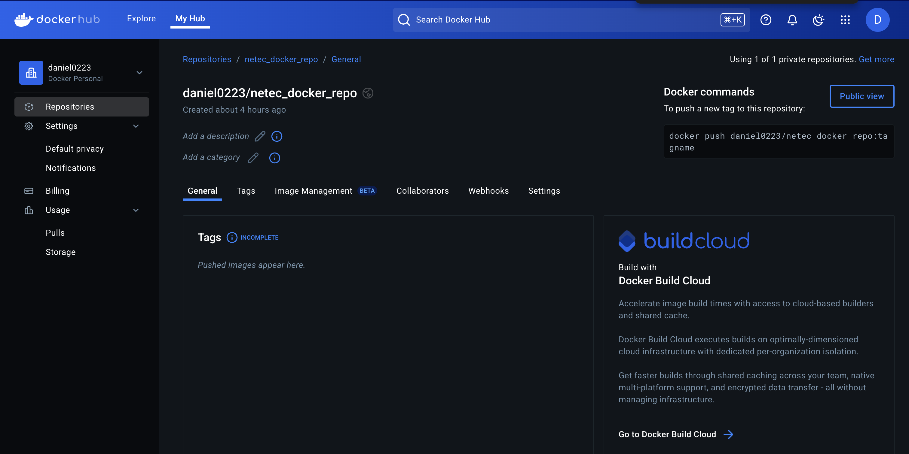

Paso 5. Sube la imagen a Docker Hub.

```bash
docker push daniel0223/netec_docker_repo
```

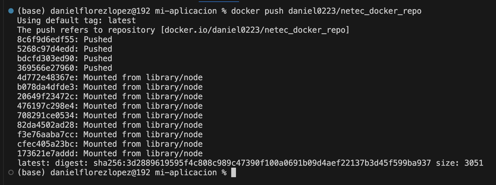

Paso 6. Verifica que la imagen se haya subido correctamente.

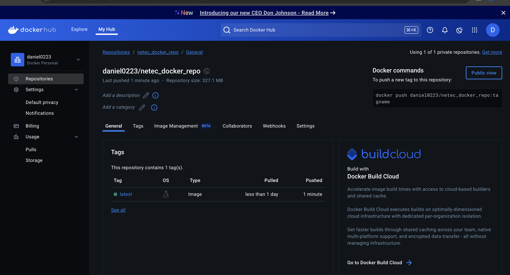

Paso 7. Crea el contenedor con la imagen de Docker.

```bash
docker run -d -p 3000:3000 daniel0223/netec_docker_repo
```

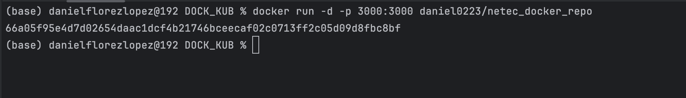

Paso 8. Verifica que el contenedor se haya creado correctamente.

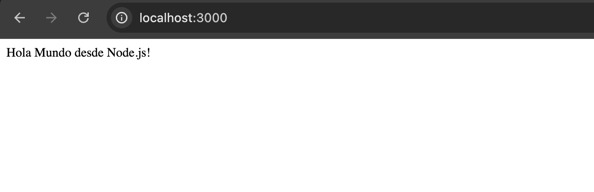

### Tarea 3. Desplegar en Kubernetes.

Paso 1. Crea un archivo de despliegue de Kubernetes.

```yaml
apiVersion: apps/v1
kind: Deployment
metadata:
  name: mi-aplicacion-node
spec:
  replicas: 2
  selector:
    matchLabels:
      app: mi-aplicacion-node
  template:
    metadata:
      labels:
        app: mi-aplicacion-node
    spec:
      containers:
        - name: mi-aplicacion-node
          image: daniel0223/netec_docker_repo
          ports:
            - containerPort: 3000
```

Paso 2. Despliega la aplicación:

```bash
kubectl apply -f deployment.yaml
```

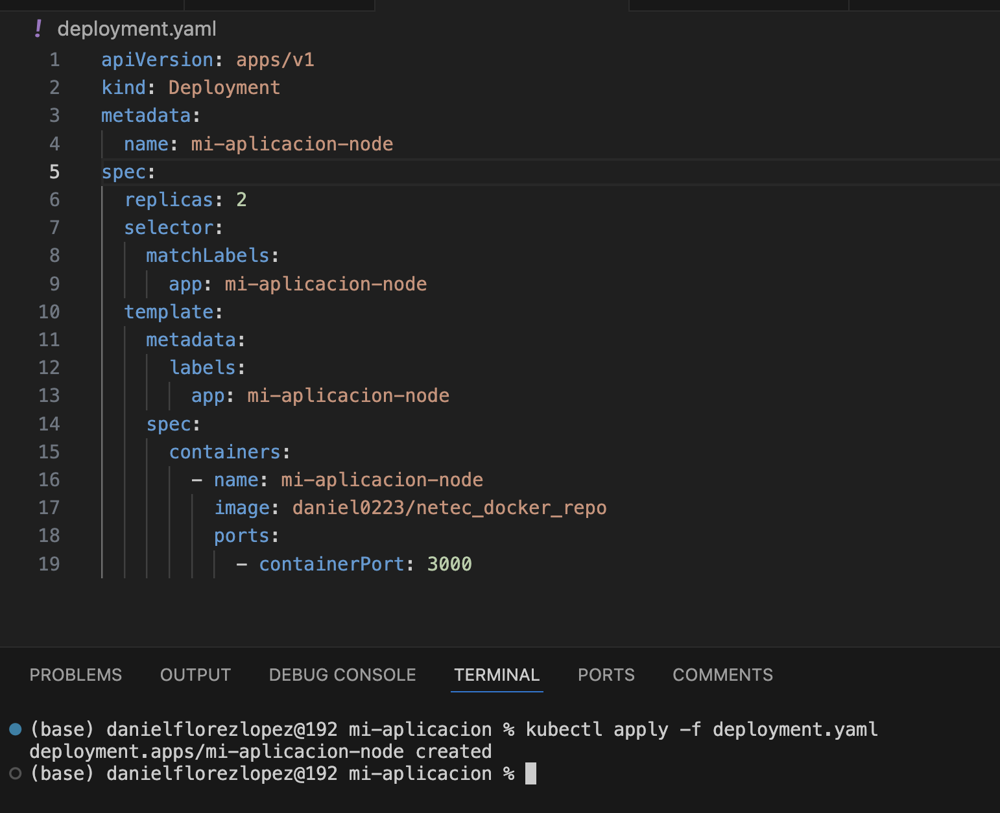

Paso 3. Expón la aplicación.

```yaml
kubectl expose deployment mi-aplicacion-node --type=LoadBalancer --port=3000
```

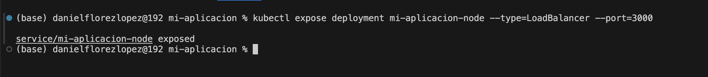

Paso 4. Verifica que el servicio se haya creado correctamente.

```bash
kubectl get svc
```

### Resultado esperado:

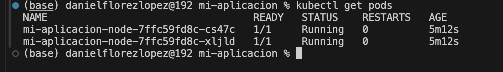
