# Práctica 8. Gestión de namespaces y despliegue de recursos en Kubernetes

## Objetivo de la práctica:
Al finalizar la práctica, serás capaz de:
- Comprender el concepto de namespaces en Kubernetes y su importancia en la organización y gestión de recursos dentro de un clúster.
- Aprender a crear y utilizar namespaces para desplegar y administrar diferentes tipos de objetos en Kubernetes.
- Implementar recursos clave de Kubernetes, incluyendo ReplicaSets, Jobs, DaemonSets y Deployments, dentro de namespaces específicos.

## Duración aproximada:
- 90 minutos.

---

**[⬅️ Atrás]()** | **[Lista General]()** | **[Siguiente ➡️]()**

---

## Instrucciones:

- Crear un nuevo namespace en Kubernetes, aprendiendo a segmentar el clúster en espacios lógicos para una mejor organización y seguridad.
- Desplegar un objeto de tipo ReplicaSet en el namespace recién creado, aprendiendo a gestionar y escalar aplicaciones en Kubernetes.
- Crear un nuevo namespace en Kubernetes, aprendiendo a segmentar el clúster en espacios lógicos para una mejor organización y seguridad.

### Tarea 1. Crear proyecto Node JS.

Paso 1. Crea una carpeta con el nombre `mi-proyecto-nodejs` para inicializar el proyecto.

```bash
mkdir mi-proyecto-nodejs
cd mi-proyecto-nodejs
npm init -y
```

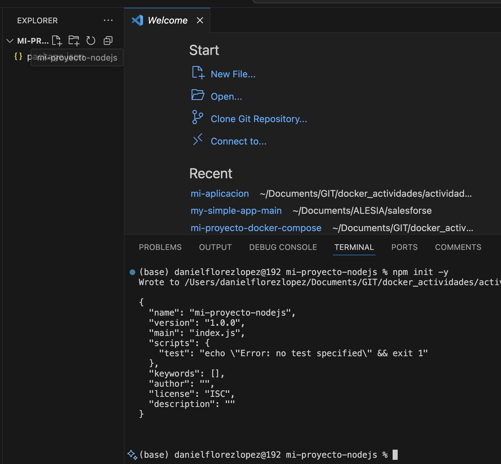

Paso 2. Crea el archivo `index.js` y agrega el siguiente código:

```javascript
const express = require('express');
const app = express();
const PORT = process.env.PORT || 3000;
app.get('/', (req, res) => {
res.send('Hola Mundo desde Node.js!');
});
app.listen(PORT, () => {
console.log(`Servidor corriendo en puerto ${PORT}`);
});
```

Paso 3. Instala **express**.

```bash
npm install express
```

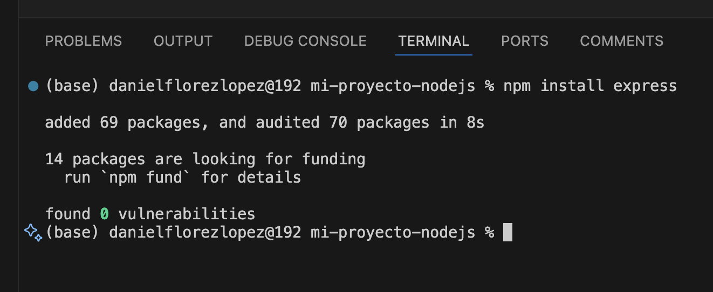

Paso 4. Crear un archivo Dockerfile.

```Dockerfile
FROM node:14
WORKDIR /app
COPY package*.json ./
RUN npm install
COPY . .
EXPOSE 3000
CMD ["node", "index.js"]
```

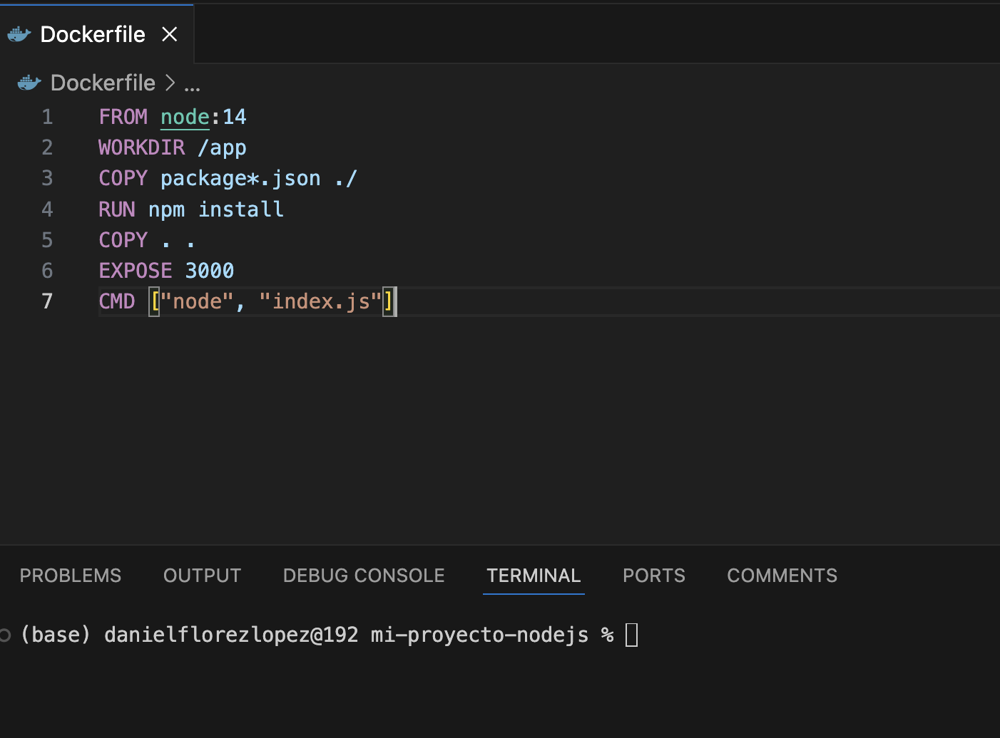

Paso 5. Sube la imagen a Docker Hub.

```bash
docker build -t daniel0223/netec_docker_repo:v1 .
docker push daniel0223/netec_docker_repo:v1
```

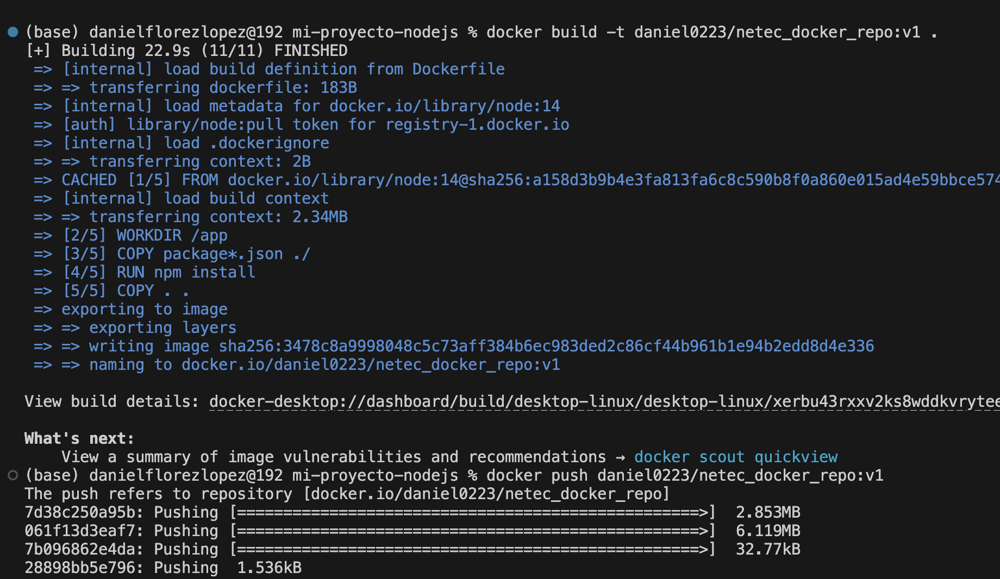


### Tarea 2. Desplegar en Kubernetes.
Paso 1. Crea el namespace con el nombre `namespace.yaml`.

```yaml
apiVersion: v1
kind: Namespace
metadata:
  name: mi-namespace
```

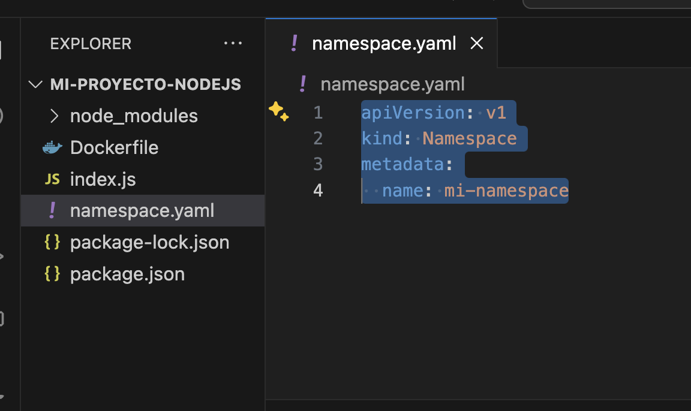

Paso 2. Aplica y crea el namespace.

```bash
kubectl apply -f namespace.yaml
```

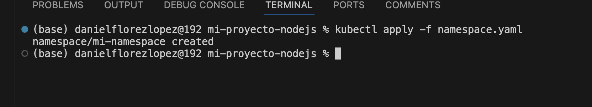

Paso 3. Crea el archivo `deployment.yaml`.

```yaml
# deployment.yaml
apiVersion: apps/v1
kind: Deployment
metadata:
  name: mi-deployment
  namespace: mi-namespace
spec:
  replicas: 3
  selector:
    matchLabels:
      app: mi-app-nodejs
  template:
    metadata:
      labels:
        app: mi-app-nodejs
    spec:
      containers:
        - name: mi-app-nodejs
          image: daniel0223/netec_docker_repo:v1
          ports:
            - containerPort: 3000
```

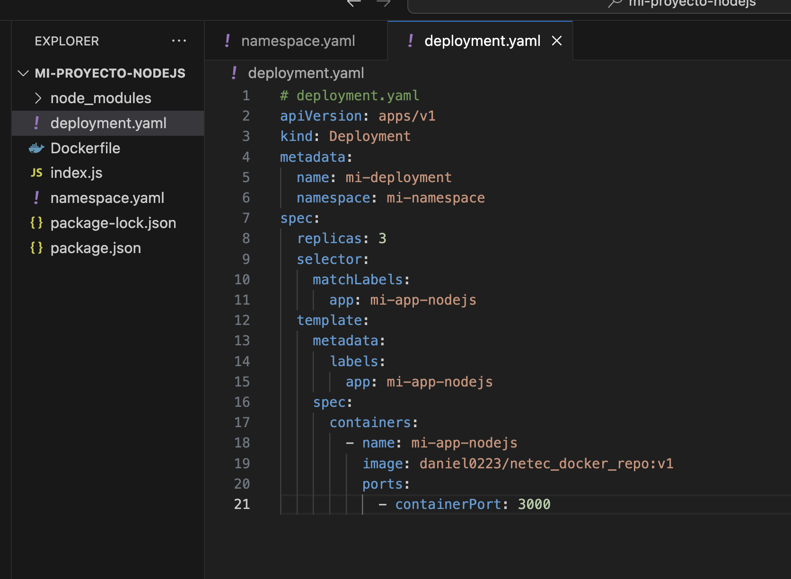

Paso 4. Aplica el **deployment**.

```bash
kubectl apply -f deployment.yaml
```

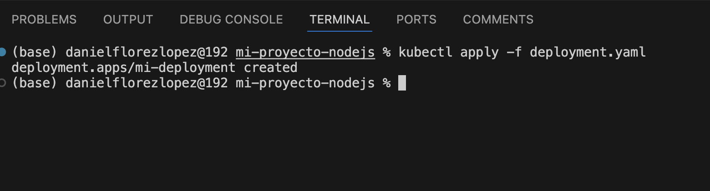

Paso 5.  Crea el **ReplicaSet** y ejecútalo: 

```yaml
# replicaset.yaml
apiVersion: apps/v1
kind: ReplicaSet
metadata:
  name: mi-replicaset
  namespace: mi-namespace
spec:
  replicas: 3
  selector:
    matchLabels:
      app: mi-app-nodejs
  template:
    metadata:
      labels:
        app: mi-app-nodejs
    spec:
      containers:
        - name: mi-app-nodejs
          image: daniel0223/netec_docker_repo:v1
          ports:
            - containerPort: 3000

```

```bash
kubectl -f replicaset.yaml apply
```

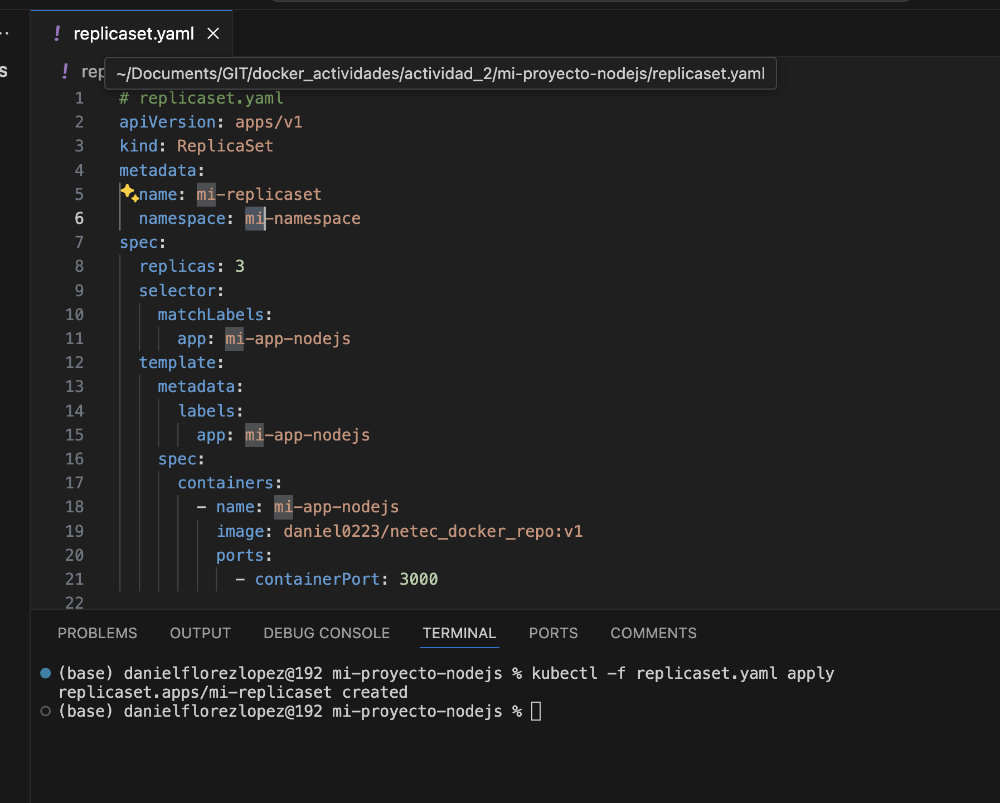

Paso 6. Creación del **StatefulSet** y ejecución:

```yaml
# statefulset.yaml
apiVersion: apps/v1
kind: ReplicaSet
metadata:
  name: mi-replicaset
  namespace: mi-namespace
spec:
  replicas: 3
  selector:
    matchLabels:
      app: mi-app-nodejs
  template:
    metadata:
      labels:
        app: mi-app-nodejs
    spec:
      containers:
        - name: mi-app-nodejs
          image: daniel0223/netec_docker_repo:v1
          ports:
            - containerPort: 3000

```

```bash
kubectl -f statefulset.yaml apply
```

Paso 7. Creación **DaemonSet**, y ejecución: 
```yaml
# daemonset.yaml
apiVersion: apps/v1
kind: DaemonSet
metadata:
  name: mi-daemonset
  namespace: mi-namespace
spec:
  selector:
    matchLabels:
      app: mi-app-nodejs
  template:
    metadata:
      labels:
        app: mi-app-nodejs
    spec:
      containers:
        - name: mi-app-nodejs
          image: daniel0223/netec_docker_repo:v1
          ports:
            - containerPort: 3000
```

```bash
kubectl -f statefulset.yaml apply
```
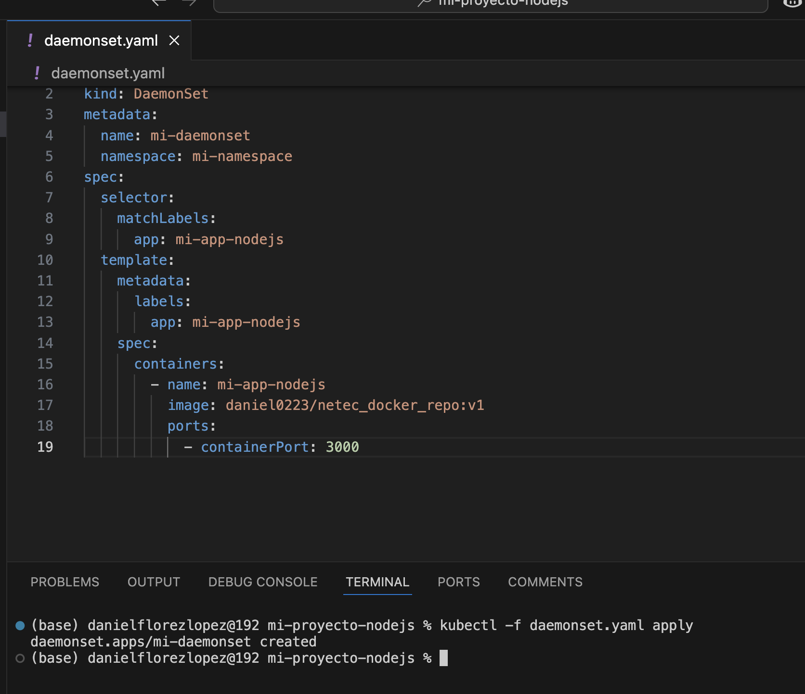

Paso 8. Verifica que la configuración esté completa.

```yaml
kubectl get all -n mi-namespace
```

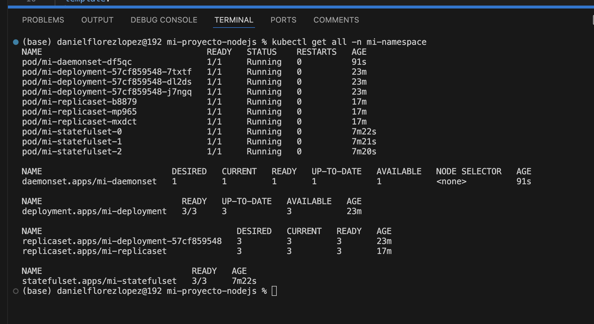

## Resultado esperado:


