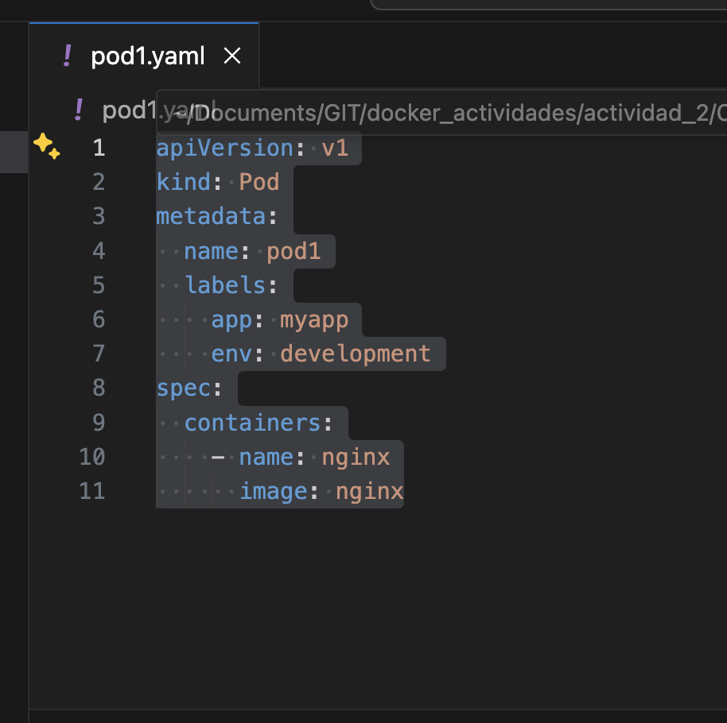
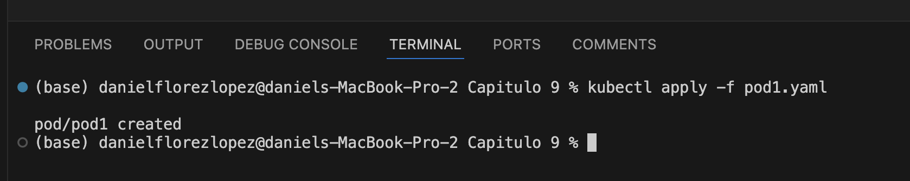
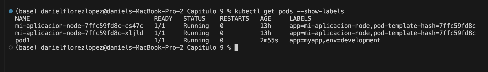
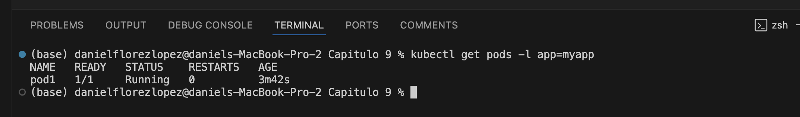
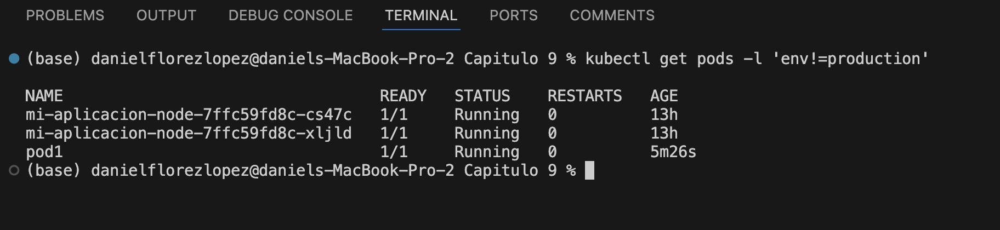

# Práctica 9. Trabajo con volúmenes emptyDir en Kubernetes

## Objetivo de la práctica:
Al finalizar la práctica, serás capaz de:
- Entender desde una manera práctica cómo interactuar con Kubernetes.
- Realizar operaciones básicas en Kubernetes.

## Duración aproximada:
- 80 minutos.

---

**[⬅️ Atrás]()** | **[Lista General]()** | **[Siguiente ➡️]()**

---

## Instrucciones:
En esta práctica, comprenderás cómo utilizar **labels** y **selectors** para organizar y seleccionar recursos en Kubernetes.

### Tarea 1. Creación de un pod con labels y selectors.

Paso 1. Crea un yaml con el nombre de `pod1.yaml`.

```yaml
apiVersion: v1
kind: Pod
metadata:
  name: pod1
  labels:
    app: myapp
    env: development
spec:
  containers:
    - name: nginx
      image: nginx
```



Paso 2. Crea el pod con el siguiente comando:

```bash
kubectl apply -f pod1.yaml
```



### Tarea 2. Listar los pods con labels y selectors.

Paso 1. Lista los pods con el siguiente comando:

```bash
kubectl get pods --show-labels
```



Paso 2. Lista los pods con el selector `app=myapp`.

```bash
kubectl get pods -l app=myapp
```



### Tarea 3. Actualizar los labels de un pod.

Paso 3. Actualiza los labels del **pod1** con el siguiente comando:

```bash
kubectl get pods -l app=myapp,env=development --show-labels
```

### Resultado esperado:

Al finalizar, podrás visualizar los labels de los pods.


